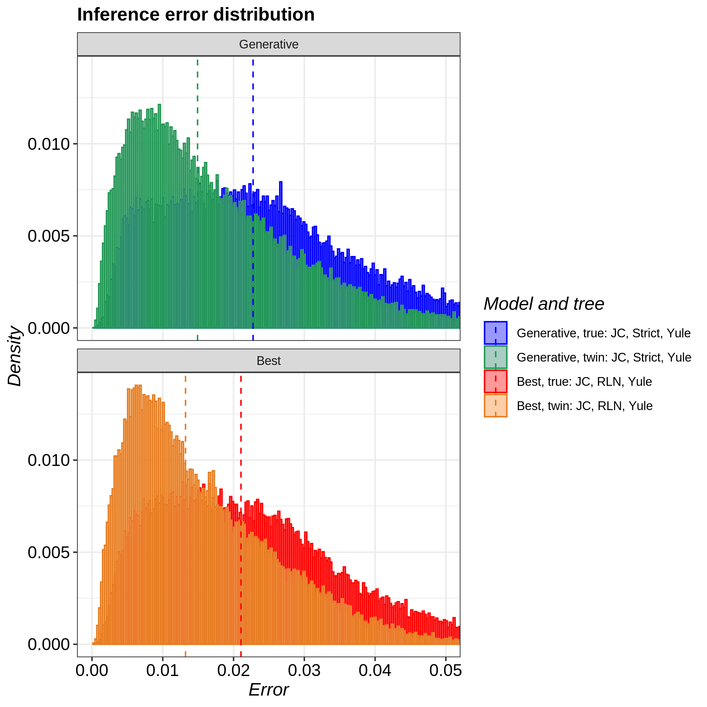

# pirouette_example_29

Branch   |
---------|--------------------------------------------------------------------------------------------------------------------------------------------------------------
`master` |
`develop`|

A [pirouette example](https://github.com/richelbilderbeek/pirouette_examples)
that shows the effect of MCMC chain length on ESS.

## Results

