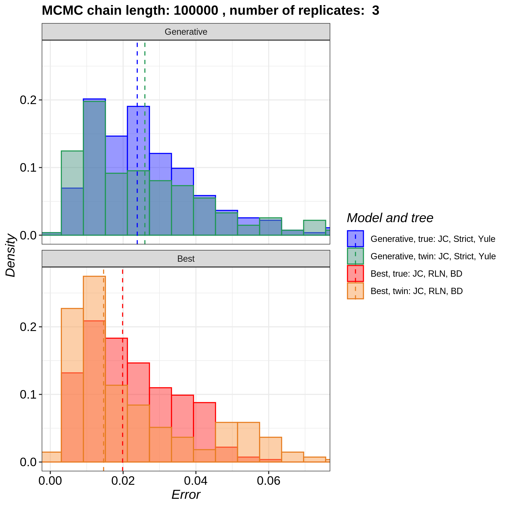
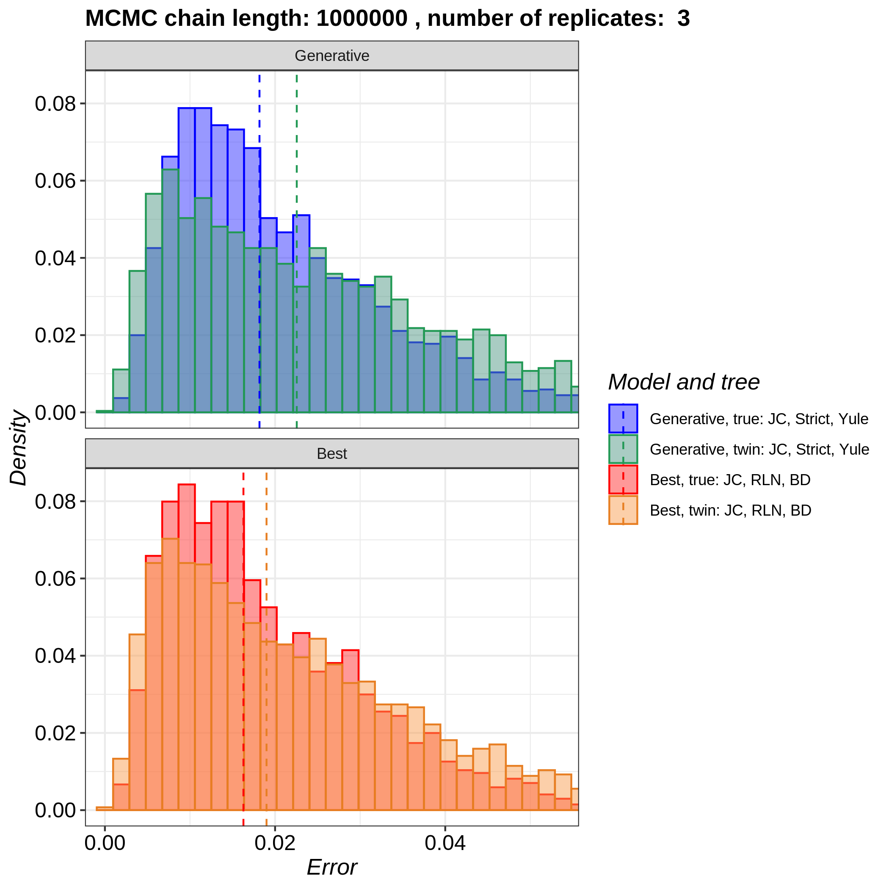
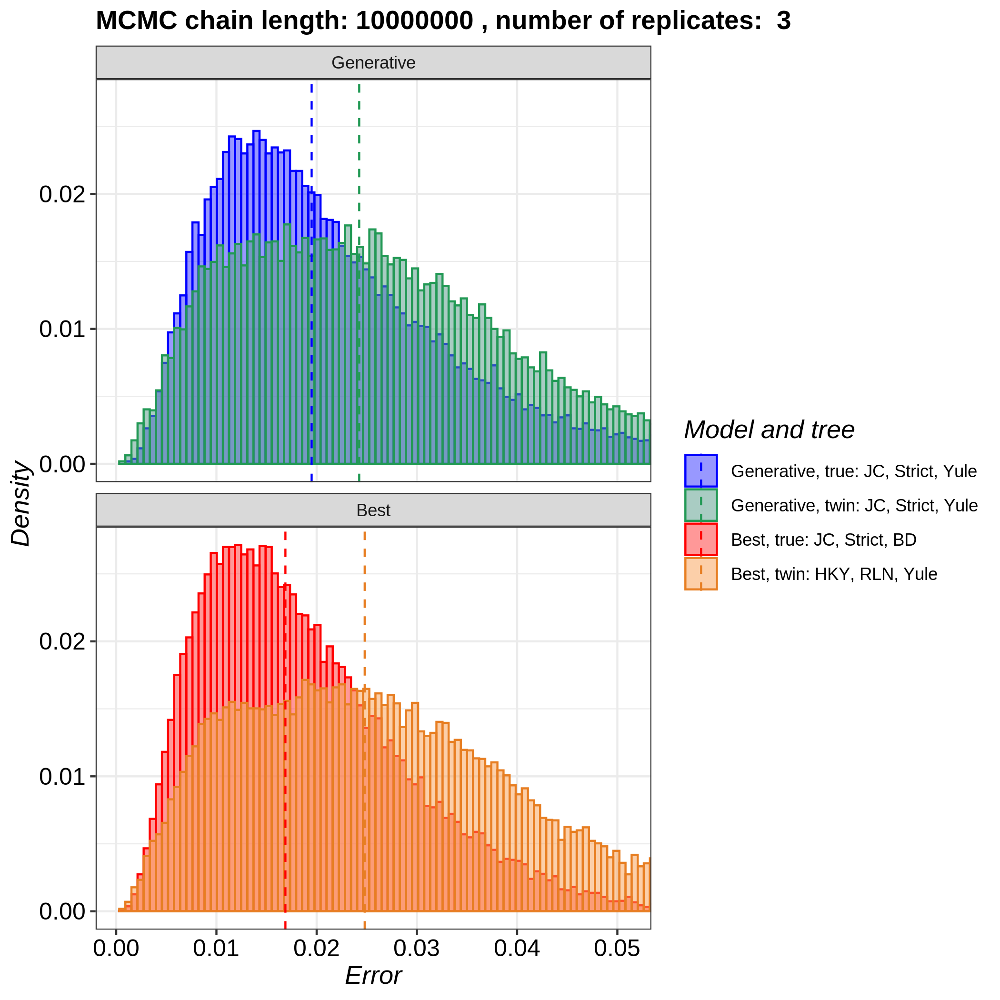
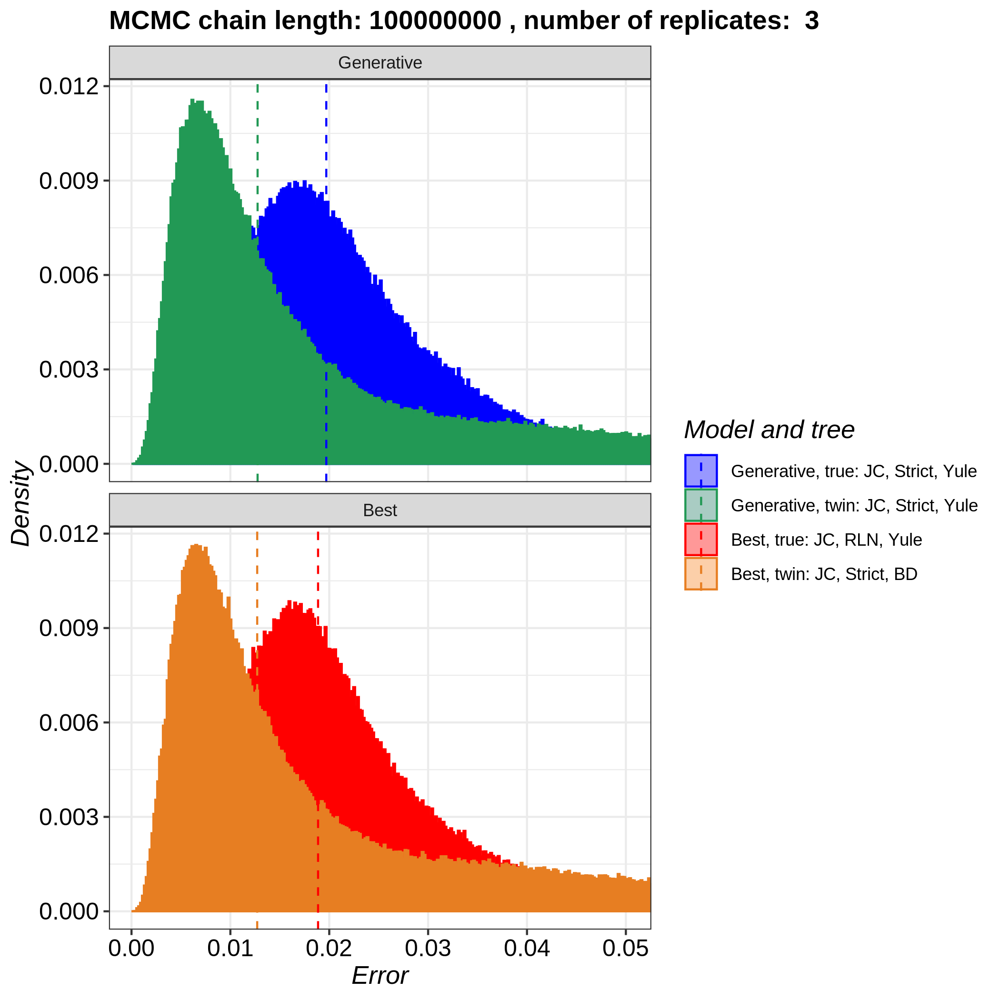

# pirouette_example_29

Branch   |[](https://travis-ci.com)                                                                                                 |[](https://appveyor.com)                                                                                               
---------|--------------------------------------------------------------------------------------------------------------------------------------------------------------|------------------------------------------
`master` |[](https://travis-ci.com/richelbilderbeek/pirouette_example_29) |[](https://ci.appveyor.com/project/richelbilderbeek/pirouette-example-29/branch/master)
`develop`|[](https://travis-ci.com/richelbilderbeek/pirouette_example_29)|[](https://ci.appveyor.com/project/richelbilderbeek/pirouette-example-29/branch/develop)

A [pirouette example](https://github.com/richelbilderbeek/pirouette_examples)
that shows the effect of MCMC chain length on ESS.

## Running on Peregrine

Install `pirouette` using the [peregrine](https://github.com/richelbilderbeek/peregrine)
bash and R scripts.

Then, in the main folder of this repo, type:

```
sbatch scripts/rerun.sh
```

## Results

 * Download the intermediate data at 
   [https://www.richelbilderbeek.nl/pirouette_example_29.zip](https://www.richelbilderbeek.nl/pirouette_example_29.zip)









